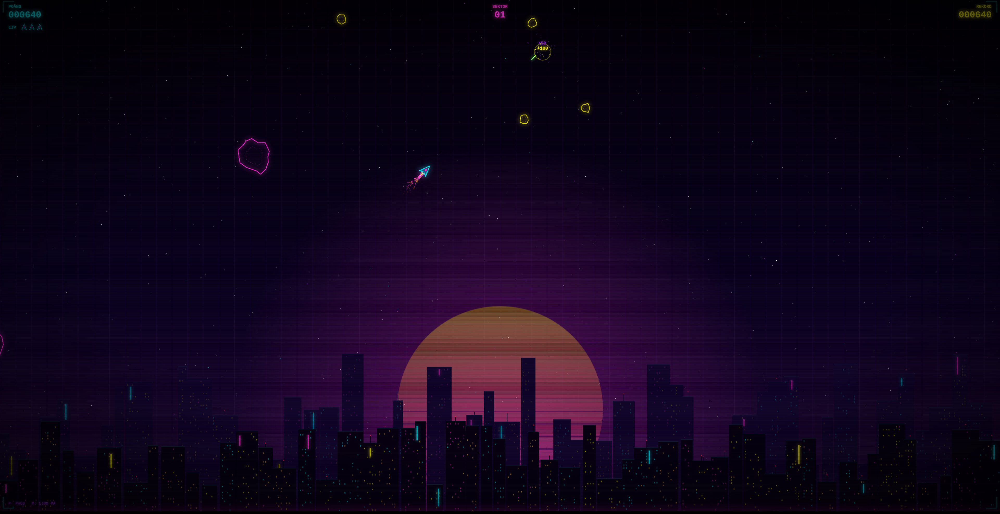

# Aipress arkad

Bilden visar spelet som Claude Opus 5.5 skrev på tankenivån xhigh. Du kan [spela det på aipress.se](https://aipress.se/files/posts/claude-opus-5-5-opus-asteroid.html).

Webbläsarspel som AI-modeller har skrivit i Aipress tester. Alla modeller fick samma prompt. Varje spel är en enda HTML-fil som klarar sig utan externa bibliotek och bilder, och ingen fil har redigerats i efterhand. Här finns alla spel som modellerna lämnade, också de som inte fungerar, och tabellen visar hur det gick för vart och ett.

## Prompten vi använder i alla speltester

> Skapa ett litet webbläsarspel i en enda HTML-fil: ett rymdskepp som skjuter asteroider, i cyberpunkstil (neonfärger, mörk bakgrund). Styrning med piltangenterna, skjut med mellanslag. Visa poäng och liv. Spelet ska fungera direkt när filen öppnas i en webbläsare, utan externa bibliotek eller bilder. Svara med endast HTML-filen i ett kodblock.

## Spelen

Tankenivån styr hur mycket modellen får resonera innan den svarar. Tid anger hur länge modellen arbetade med spelet, och kostnaden är beräknad med modellens API-pris. Alla spel som startade provades vid både 60 och 144 bilder per sekund (Hz), eftersom ett spel kan bete sig olika på en vanlig och en snabb skärm.

| Modell | Tankenivå | Resultat | Tid | Kostnad | Källkod | Spela |
|---|---|---|---:|---:|---|---|
| Claude Opus 5.5 | medium | 🟠 Fungerar, men skeppet blir trögare vid 144 Hz | 54 s | 0,154 dollar | [medium.html](claude-opus-5-5/medium.html) | |
| Claude Opus 5.5 | high | Fungerar | 1 min 38 s | 0,254 dollar | [high.html](claude-opus-5-5/high.html) | |
| Claude Opus 5.5 | xhigh | Fungerar | 7 min 10 s | 1,144 dollar | [xhigh.html](claude-opus-5-5/xhigh.html) | [Spela](https://aipress.se/files/posts/claude-opus-5-5-opus-asteroid.html) |
| Claude Opus 5.5 | max | Fungerar | 29 min 44 s | 4,541 dollar | [max.html](claude-opus-5-5/max.html) | |
| GPT-6 Sol | low | Fungerar | 53 s | 0,051 dollar | [low.html](gpt-6-sol/low.html) | |
| GPT-6 Sol | medium | Fungerar | 56 s | 0,052 dollar | [medium.html](gpt-6-sol/medium.html) | |
| GPT-6 Sol | high | Fungerar | 1 min 9 s | 0,060 dollar | [high.html](gpt-6-sol/high.html) | |
| GPT-6 Sol | xhigh | Fungerar | 1 min 57 s | 0,086 dollar | [xhigh.html](gpt-6-sol/xhigh.html) | [Spela](https://aipress.se/files/posts/gpt-6-sol-neon-asteroids.html) |
| GPT-6 Luna | medium | Fungerar | 1 min 7 s | 0,003 dollar | [medium.html](gpt-6-luna/medium.html) | [Spela](https://aipress.se/files/posts/gpt-6-luna-neon-asteroids.html) |
| GPT-6 Astra | medium | Fungerar | 59 s | 0,217 dollar | [medium.html](gpt-6-astra/medium.html) | [Spela](https://aipress.se/files/posts/gpt-6-astra-neon-drift.html) |
| Grok 4.7 | medium | 🔴 Kraschar vid start | 45 s | 0,027 dollar | [medium.html](grok-4-7/medium.html) | |
| Grok 4.7 | high | 🔴 Kraschar vid start | 52 s | 0,033 dollar | [high.html](grok-4-7/high.html) | |
| Grok 4.7 | xhigh | 🟠 Fungerar vid 60 Hz, men är slut efter drygt en sekund vid 144 Hz | 34 s | 0,021 dollar | [xhigh.html](grok-4-7/xhigh.html) | [Spela](https://aipress.se/files/posts/grok-4-7-grok-asteroid.html) |

Sex av spelen går att spela direkt på aipress.se. De andra kan du ladda ner och öppna i webbläsaren.

## Vad testerna visade

För Claude Opus 5.5 och GPT-6 Sol gav högre tankenivå mer påkostade spel med fler effekter och längre kod, men grundfunktionerna fanns redan på den lägsta nivån vi testade. Opus 5.5 arbetade i nästan en halvtimme på max och kostade närmare 30 gånger mer än på medium, och båda versionerna uppfyllde samma krav.

Grok 4.7 fick ett spel som startade först på sin högsta nivå, xhigh. På medium och high kraschade spelen redan på den första bildrutan, eftersom koden använde listorna med asteroider, skott och partiklar innan de hade skapats. Spelet från xhigh fungerar, men dess rörelser följer skärmens bildfrekvens i stället för verklig tid. På en skärm med 144 Hz går det därför 2,4 gånger för fort och är över efter drygt en sekund.

Hela testerna, med bedömningar och jämförelser mellan modellerna, finns i artiklarna om [Claude Opus 5.5](https://aipress.se/nyheter/claude-opus-5-5/), [GPT-6 Sol och Luna](https://aipress.se/nyheter/gpt-6-sol-och-luna/), [GPT-6 Astra](https://aipress.se/nyheter/gpt-6-astra/) och [Grok 4.7](https://aipress.se/nyheter/grok-4-7/).
